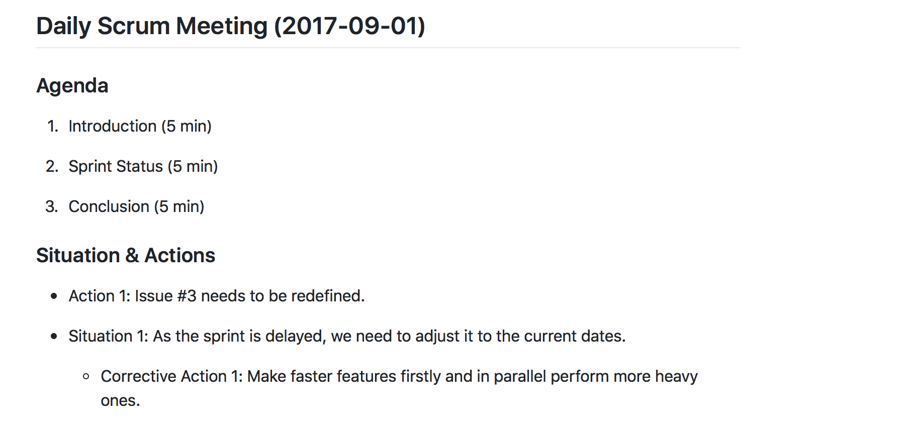
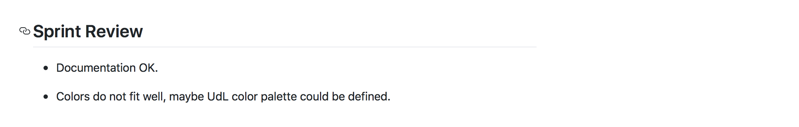
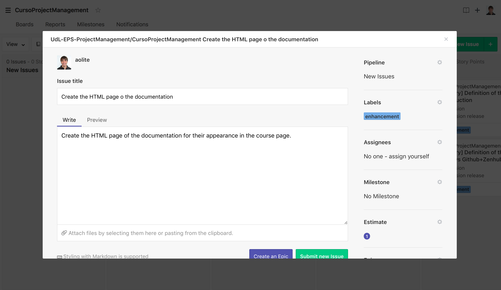
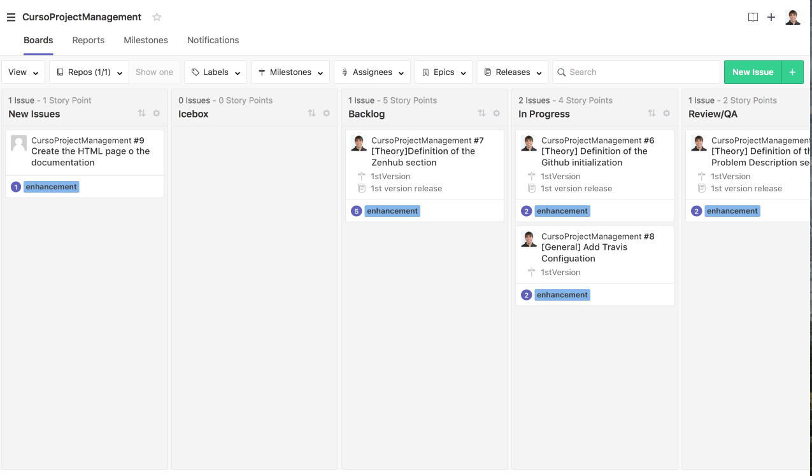
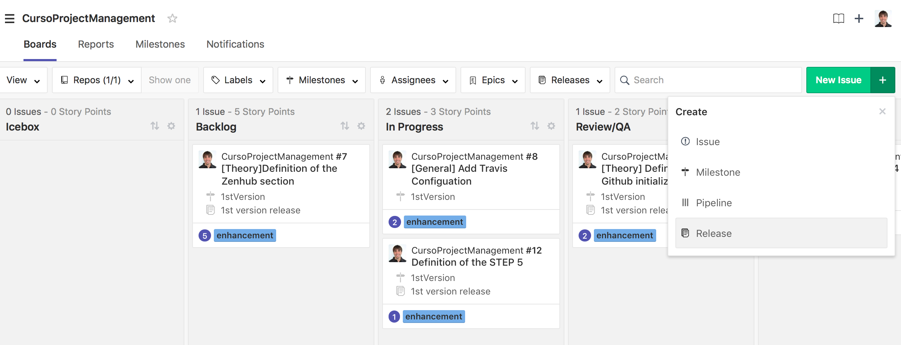
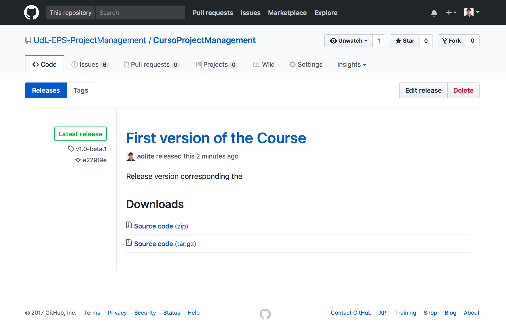

= Zenhub + Github, when agile become a reality
:author: Aitor Corchero Rodiguez
:email: aitor.corchero@eurecat.org
:description: Presentation about how to use Zenhub and Github for Agile project management. 
:revdate: 2017-09-02
:revnumber: 0.1
:backend: deckjs
:split:
:deckjs_theme: web-2.0
:deckjs_transition: fade
:navigation:
:menu:
:toc: right
:blank:
:status:
:icons: font

== Agile methodology

image::../resources/agile.jpg[]

== Zenhub + Github = Agile

[cols="40,60", options="header"] 
.Agile vs Github & Zenhub
|===
|Element
|Description

|Stories/User Stories
|Issues 

|Sprint Backlog
| Backlog list in the board (Zenhub). Milestoned & unsassigned issues.

|Global backlog (or new issues)
| Icebox in the board (Zenhub). Unmilestoned & unassigned issues

|Sprints Planning
| Issues associated to the milestone

|Sprints
| Milestones

|Sprint Planning Meeting
| Wiki (Github)

|Daily Scruum Meeting
| Wiki (Github) & Burndown/up charts (Zenhub reports)

|Sprint Review
| Wiki (Github)

|Finished Work
| Code release (Github)

|===

== Hands on Github and Zenhub

[quote]
eCORP, a larger company in business development, wants to elaborate the curse documentation for training their customers and employes. With this regards, we need to manage the development and resources to do it efficiently in 1 week.

== STEP 1: Initialise Github

[%step]
--
* Register/LogIn in Github. 
--
[%step]
--
* Create new repository
--

[%step]
--
* Create new repository
--

<<< 
**Register/LogIn Github**

image::../resources/GithubSignIn.png[]

<<<
**Create new repository**

image::../resources/grepocreation.png[]

<<<
**Repository main page**

image::../resources/grepopage.png[]

== STEP 2: Continous documentation of Agile Meetings

Continous documentation of agile meetings for maintaning the team update: 

[%step]
--
* Sprint Planning Meeting
--
[%step]
--
* Daily Scrum Meeting
--

[%step]
--
* Sprint Review
--

<<<
**Sprint Planning Meeting**

image::../resources/sprintPlanning.png[]

<<<
**Daily Scrum Meeting**

<<<
**Sprint Review**

== STEP 3: General Backlog

...........................................
We need to work with Zenhub. So, we need to install the chrome extension or use the web app.
...........................................

image::../resources/gnewboard.png[]

<<<
**Create new Issues**

<<<
**Product Backlog**

image::../resources/productBacklog.png[]

<<<
**Product Backlog**

image::../resources/productBacklog.png[]

== STEP 4: Sprint Backlog

...........................................
In the sprnt backlog we have to make a milestone (using Zenhub or Github, no matters)
...........................................

<<<
**Create a milestone**

image::../resources/newMilestone.png[]

<<<
[quote]
For the sprint planning assign issues from the product backlog into the milestone and move the issue the column. 

== STEP 5: Sprint Planning

[quote]
One method to know how is going the sprint is by the burndown graph. In Zenhub, this is placed inside Reports. 

<<<
image::../resources/gburndown.png[]

== STEP 6: Product Release

[quote]
Prototype generation to show it to the customer. Here we explore two aspects:  Release planning management (Zenhub), Release placement (Github)

<<< 
**Release Planning Management**

<<< 
**Release Placement (release generation)**

image::../resources/greleaseform.png[]

<<< 
**Release Placement (release result)**

== Conclusions

* Agile basics
* Agile implementation in Github
* Agile implementation in Zenhub

