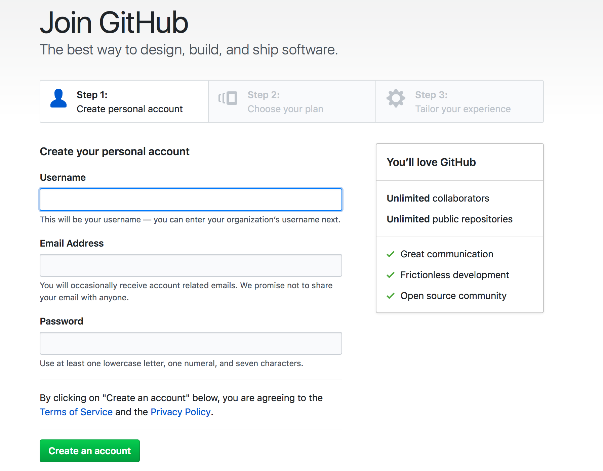

= Zenhub + Github, when agile become a reality
:author: Aitor Corchero Rodiguez
:email: aitor.corchero@eurecat.org
:description: Presentation about how to use Zenhub and Github for Agile project management. 
:revdate: 2017-09-02
:revnumber: 0.1
:backend: deckjs
:split:
:deckjs_theme: web-2.0
:deckjs_transition: fade
:navigation:
:menu:
:toc: right
:blank:
:status:

== Agile methodology

image::../resources/agile.jpg[]

== Zenhub + Github = Agile

[cols="40,60", options="header"] 
.Agile vs Github & Zenhub
|===
|Element
|Description

|Stories/User Stories
|Issues 

|Sprint Backlog
| Backlog list in the board (Zenhub). Milestoned & unsassigned issues.

|Global backlog (or new issues)
| Icebox in the board (Zenhub). Unmilestoned & unassigned issues

|Sprints Planning
| Issues associated to the milestone

|Sprints
| Milestones

|Sprint Planning Meeting
| Wiki (Github)

|Daily Scruum Meeting
| Wiki (Github) & Burndown/up charts (Zenhub reports)

|Sprint Review
| Wiki (Github)

|Finished Work
| Code release (Github)

|===

== Hands on Github and Zenhub

[quote]
eCORP, a larger company in business development, wants to elaborate the curse documentation for training their customers and employes. With this regards, we need to manage the development and resources to do it efficiently in 1 week.

== STEP 1: Initialise Github

[%step]
--
* Register/LogIn in Github. 
--
[%step]
--
* Create new repository
--

[%step]
--
* Create new repository
--

<<< 
**Register/LogIn Github**

<<<
**Create new repository**

image::../resources/grepocreation.png[]

<<<
**Repository main page**

image::../resources/grepopage.png[]

