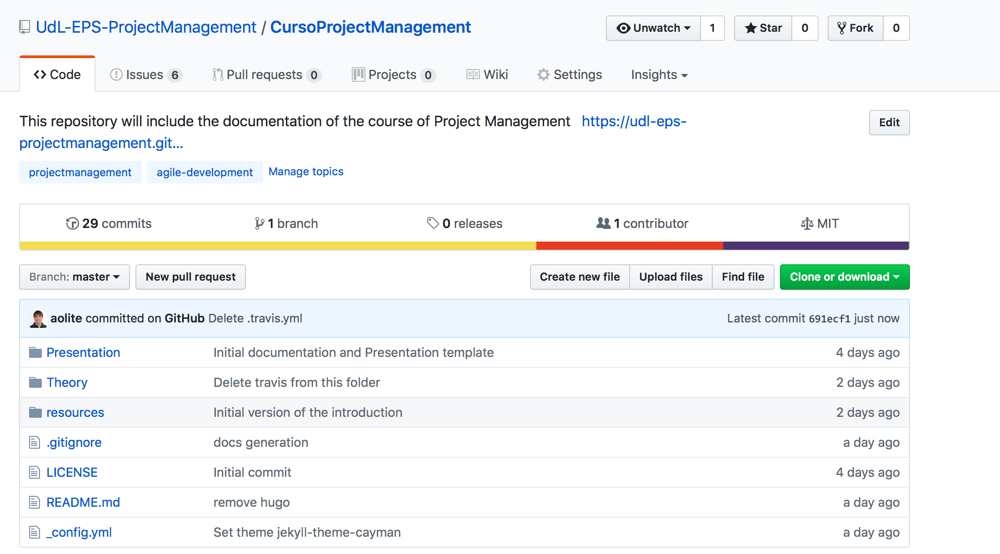
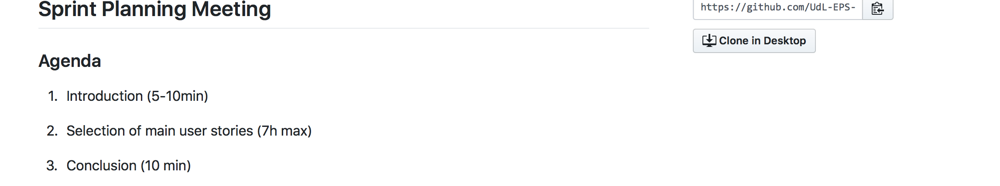
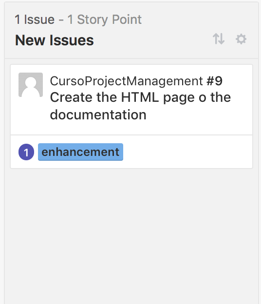

= Project Management Course: Zenhub + Github, when agile become a reality
Aitor Corchero <aitor.corchero@eurecat.org>
:version: 1.0
:toc: left
:toc-title: Project Management

== Introduction

Agile development or simply agile is a software methodology development that promotes the flexibility, interactivity and transparency <<Szalvay-2004>>.  

Agile software development projects are based on the nature of evolving (not fixed) requirements, (re-) usable code and the continous testing. This methodology (see <<agile_elem, Table 1>> ) key elements are: 

[cols="40,60", options="header"] 
[[agile_elem]]
.Agile key elements
|===
|Element
|Description

|Stories/User Stories
|Refers to the user requirements that also corresponds with product features.

|Sprint Backlog
|The collection of work scheduled for a sprint. At the begining of each sprint, the team decides the work to do during the sprint. These tasks should be organised by priority.

|Global backlog (or icebox)
| A collection of all user-stories. When a new user-story is defined, it is stored in the global backlog for their selection. Thus, the development team select them and introduce into the sprint. The main intention is to priorize as well the tasks for making simple their selection.

|Sprints
| Iteration cycles of the development cycle. Normaly 2-4 weeks. The main objective is to provide a small development (or prototype) to the customers.
|===

The agile development cycle (<>) starts with the definition of the product backlog (user-stories, featues, etc.). During the spring planning, stories are selected to be implemented. Thus, it pass to the sprint backlog. 

During the sprint development the stories are implemented and evaluated during 1-4 weeks. Each day during the sprint, several daily scrum meetings are performed to evaluate the work, the level of accomplishent and the project execution. Then, burndown and velocity charts are revised to see if the sprint is delayed, on time or faster than expected. 

At the end of each sprint, a sprint review is performed in order to underestand the mistakes (learn from the experience). Moreover, the product is provided to the customer and a feedback from user is received, an new stories could appear. 

[#img-agile] 
.Agile development cycle
image::../resources/agile.jpg[]

== Agile Methodology in Github & Zenhub

The agile methodology is fully compatible with Github and Zenhub. In detail, Github provides a framework for managing documents (code, text, etc), coutinous follow-up of the project (using the Wiki, for example), and more important, managing the product releases (output of each spint). 

Complementary, Zenhub provides a kanban model for managing the global backlogs, sprint backlogs, provide burndown reports, managing the isues life-cycle and, define objectives (sprints and product releases).

Considering these overall description of the Github and Zenhub usage, the <<agile_ict, Table 2>> provide the association between Agile and the depicted tools. 

[cols="40,60", options="header"] 
[[agile_ict]]
.Agile vs Github & Zenhub
|===
|Element
|Description

|Stories/User Stories
|Issues 

|Sprint Backlog
| Backlog list in the board (Zenhub). Milestoned & unsassigned issues.

|Global backlog (or new issues)
| Icebox in the board (Zenhub). Unmilestoned & unassigned issues

|Sprints Planning
| Issues associated to the milestone

|Sprints
| Milestones

|Sprint Planning Meeting
| Wiki (Github)

|Daily Scruum Meeting
| Wiki (Github) & Burndown/up charts (Zenhub reports)

|Sprint Review
| Wiki (Github)

|Finished Work
| Code release (Github)

|===

== Hands on Github and Zenhub

[NOTE]
.Customer need
====
eCORP, a larger company in business development, wants to elaborate the curse documentation for training their customers and employes. With this regards, we need to manage the development and resources to do it efficiently in 1 week.
====

=== STEP 1. Initialise Github

To initialise Github, it is necesary to go to https://github.com. Once in the github page, you have to log in or sign in into the platform. 

[#img-gsignin] 
.GitHub Sign In page
image::../resources/GithubSignIn.png[]

Once the Github is created, the next step is to log in the platform and create a new repository. 

[#img-gmainpage] 
.GitHub main user page
image::../resources/Githubmain.png[]

In the page of creating a new repository, you have to fill the form including a repository name, description, nature of the repository, and some files for the init (readme and licence files). Once specified this parameters, press the buton create the repository to start working. 

[#img-grepocreation] 
.GitHub Github init repository
image::../resources/grepocreation.png[]

Yo have your repository created!!!! Now, browse to the repository to start working with Github. 

[#img-grepopage] 
.GitHub repository main view

Considering the repository, the main part is the code repository. But before starting with it, we will start with the Wiki (<<gwiki, Figure 6>>). The Wiki will store the sprint planning meeting, daily scrum meeting and sprint review. Moreover, it will serve also to store some ideas or additional information relevant for the project. 

[#img-gwiki] 
.Wiki for storing the meetings minutes

==== Sprint Planning Meeting

The sprint planning meeting will cover the agenda for passing the main issues from the backlog to the sprint backlog according to the customer requirements and feedbacks. 

[#img-sprintPlanning] 
.Sprint Planning Minutes and Agenda

==== Daily scrum meeting

The daily scrum meeting wiki section will cover the agenda and the main situation and actions to make successful the sprint.

[#img-scrumMeeting] 
.Daily Scrum Meeting Minutes and Agenda
image::../resources/scrumMeeting.png[]

==== Sprint Review

This part will comprise the sprint review and customer feedback main points.

[#img-sprintReview] 
.Sprint review main aspects
image::../resources/sprintReview.png[]

Once initialising Github and underestanding main documents, lets we will start defining the general backlog (issues) and the corresponding sprints.

=== STEP 2. General Backlog 

For defining and managing the issues, we will use Zenhub (https://www.zenhub.com/). For that, we have two options: 

* Chrome users: We could install the Zenhub extension (https://chrome.google.com/webstore/detail/zenhub-for-github/ogcgkffhplmphkaahpmffcafajaocjbd)
* Rest of web users, we have the web app (https://www.zenhub.com/)

Once signed up with the Gihub account into zenhub, we can start a board based on the desired repository. With that aim, the chrome users could click on the "board" button in the repository page. The others we have to select the desired project from the project list in the Zenhuub webpage.

[#img-gnewboard] 
.Project selection in Zenhub
image::../resources/gnewboard.png[]

The product backlog or "New Issues" appears in the board, so, we need to fill it with the corresponding issues. For that, we have to create new issues indicating the title and the description. The more, we have to specify the label (action of the activity) and the estimation for doing the task. The importance of the task could be determined by the order of the tasks inside the list. 

[#img-gnewissue] 
.Create new issue for the project management 
image::../resources/newIssue.png[]

After this, the board "new issue" contains the desired task to be performed. 

[#img-gbacklog] 
.Product Backlog list 

=== STEP 3. Sprint Backlog

Similar as the product backlog, the sprint backlog (or simply backlog) contains the issues with asignees and milestones. 

[#img-gboard] 
.General Overview of the board
image::../resources/board.png[]

For creating a milestone, we have to click on the button "+" at right of "new issue". Once clicked, we select "milestone" to create a new one and, the milestone form appears. In there, we select the title and the description at same as the duration. Once created, We have our first sprint defined!!!

[#img-gmilestone] 
.Create new milestone

Just now, we need to assign the tasks to the milestone (task from the sprint backlog) and we have our sprint planned and ready. 

=== STEP 4. Sprint Planning

The sprint planning corresponds with the issues associated to the milestone. To manage the sprint there exist burn down and velocity graphs just to see how the sprint is going on. These graphs are generated automatically in the Report part of the Zenhub tool. 

[#img-greport] 
.Burndown Report of the sprint

=== STEP 5. Product Release

The product release make reference to the end of the sprint and teh presentation of a prototype to the customer for getting their feedback. In the one hand, Zenhub provides an element to manage the product releases and see if the product of the sprint is ging on time or delayed. 

[#img-grelease] 
.Product Release management graph

To enable this option, we have to create a new release (similarly as the milestone) and assign the issues to that defined release (following similar steps and in the milestones). 

[#img-gnewrelease] 
.Creation of a new Release in Zenhub
image::../resources/newRelease.png[]

On the otehr hand, once the sprint is finished, we have to create the release with the corresponding code. For that, Github provide us the necessary tools. For creating a new release, we have to go the repository main page and click on the "Release" tab. Omce there, we will click on "new release" and fill the corresponding form. 

[#img-greleaseform] 
.Creation of a new Release in Github

Once completed the form, we click on the button and then, a code zip will be created with the master branch code. This will apear in the releases list.

[#img-grelase] 
.Releases page once the release has been created
image::../resources/greleaselist.png[]

== Conclusion

During this part of the course we have learn: 

- Agile basics
- Agile implementation in Github
- Agile implementation in Zenhub

[bibliography]
== References

[[Szalvay-2004]] Szalvay, V. An Introduction to Agile Software Development (2004). http://www.danube.com/docs/Intro_to_Agile.pdf

